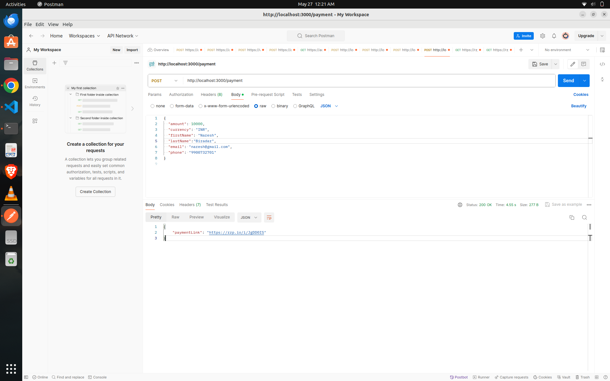
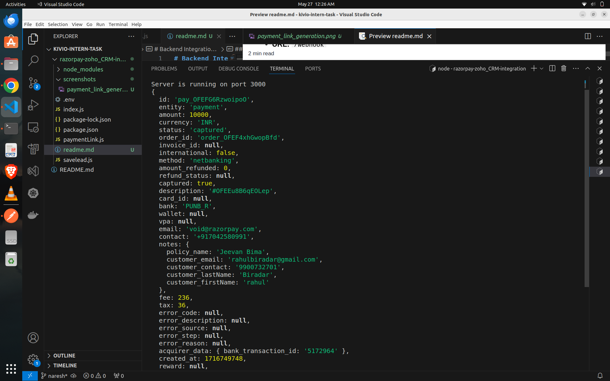
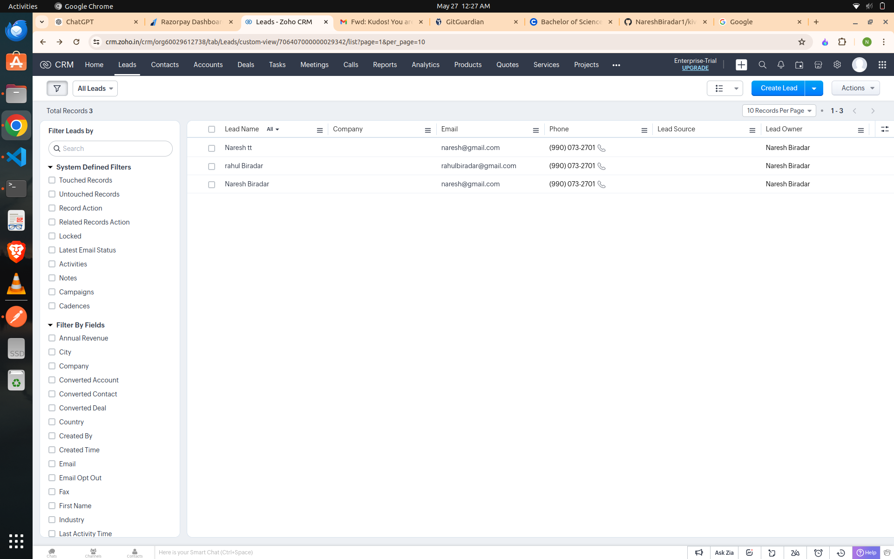

# Backend Integration with Razorpay and Zoho CRM

This project implements a backend system that handles payments via Razorpay, captures payment details through a webhook, and stores the details as leads in Zoho CRM. The backend is built using Node.js and Express.js.

## Table of Contents
- [Features](#features)
- [Installation](#installation)
- [Configuration](#configuration)
- [Usage](#usage)
- [Project Structure](#project-structure)
- [API Endpoints](#api-endpoints)
- [Screenshots](#screenshots)
- [References](#references)

## Features
- Generate Razorpay payment links.
- Capture payment details via Razorpay webhooks.
- Store payment details as leads in Zoho CRM.

## Installation
1. Clone the repository:
    ```bash
    git clone https://github.com/yourusername/yourrepository.git
    ```
2. Navigate to the project directory:
    ```bash
    cd yourrepository
    ```
3. Install dependencies:
    ```bash
    npm install
    ```

## Configuration
1. Create a `.env` file in the root directory and add the following environment variables:
    ```
    RAZORPAY_ID=your_razorpay_id
    RAZORPAY_SECRET=your_razorpay_secret
    WEBHOOK_SECRET=your_webhook_secret
    ZOHO_CLIENT_ID=your_zoho_client_id
    ZOHO_CLIENT_SECRET=your_zoho_client_secret
    ZOHO_REFRESH_TOKEN=your_zoho_refresh_token
    ```

## Usage
1. Start the server:
    ```bash
    npm start
    ```
2. The server will run on port 3000 by default.

## Project Structure
.
├── index.js
├── paymentLink.js
├── saveLead.js
├── .env
├── package.json
└── README.md


## API Endpoints

### Create Payment Link
- **URL:** `/payment`
- **Method:** `POST`
- **Description:** Generate a Razorpay payment link.
- **Request Body:**
    ```json
    {
      "amount": 50000,
      "currency": "INR",
      "firstName": "John",
      "lastName": "Doe",
      "email": "john.doe@example.com",
      "phone": "9999999999"
    }
    ```
- **Response:**
    ```json
    {
      "paymentLink": "https://rzp.io/i/abcdef"
    }
    ```

### Webhook Endpoint
- **URL:** `/webhook`
- **Method:** `POST`
- **Description:** Capture Razorpay payment details and store them as leads in Zoho CRM.
- **Request Body:** The request body is received from Razorpay's webhook.

## Screenshots


### Payment Link Generation


### Webhook Processing


### Lead Creation in Zoho CRM



## References
- [Razorpay API Documentation](https://razorpay.com/docs/)
- [Setting up Webhooks in Razorpay](https://razorpay.com/docs/webhooks/)
- [Zoho CRM API](https://www.zoho.com/crm/developer/docs/api/v2/)
- [Express.js](https://expressjs.com/)
